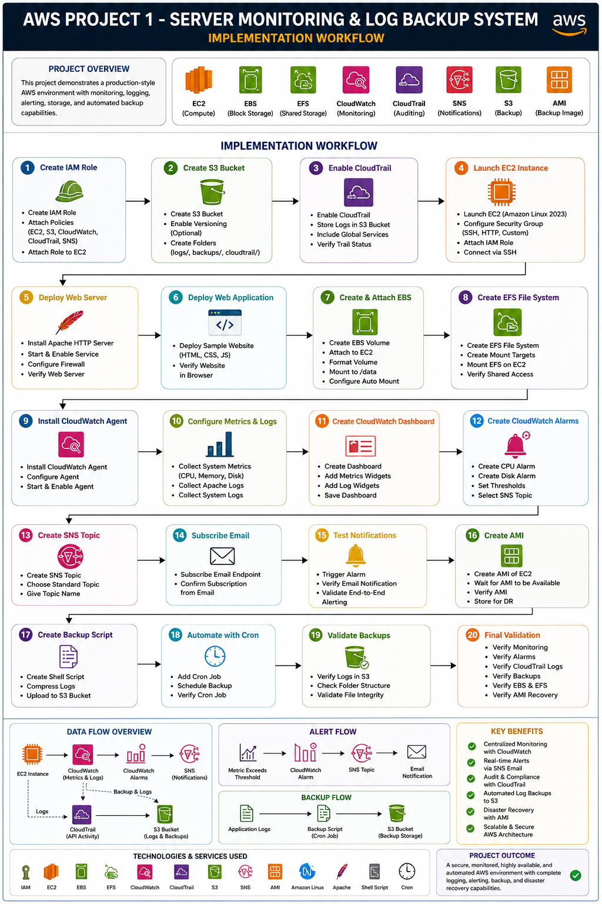

# 🚀 AWS Project 1 - Implementation Workflow

## 📖 Overview

This document outlines the complete implementation workflow for the **AWS Server Monitoring & Log Backup System**.

The project is built following a logical sequence that mirrors how a Cloud Engineer or DevOps Engineer would deploy, secure, monitor, and maintain a production server on AWS.

---

# 🎯 Project Workflow

```text
Start
 │
 ▼
Create IAM Role
 │
 ▼
Create Amazon S3 Bucket
 │
 ▼
Enable AWS CloudTrail
 │
 ▼
Launch Amazon EC2 Instance
 │
 ▼
Attach IAM Role to EC2
 │
 ▼
Deploy Apache Web Server
 │
 ▼
Deploy Sample Web Application
 │
 ▼
Create & Attach Amazon EBS Volume
 │
 ▼
Create Amazon EFS File System
 │
 ▼
Mount Amazon EFS on EC2
 │
 ▼
Install CloudWatch Agent
 │
 ▼
Configure CloudWatch Metrics & Logs
 │
 ▼
Create CloudWatch Dashboard
 │
 ▼
Create CloudWatch Alarms
 │
 ▼
Create Amazon SNS Topic
 │
 ▼
Subscribe Email Endpoint
 │
 ▼
Test Email Notifications
 │
 ▼
Create Amazon Machine Image (AMI)
 │
 ▼
Create Log Backup Script
 │
 ▼
Upload Logs to Amazon S3
 │
 ▼
Automate Backup using Cron
 │
 ▼
Validate Monitoring & Alerts
 │
 ▼
Verify CloudTrail Logs
 │
 ▼
Test Disaster Recovery using AMI
 │
 ▼
Project Completed
```

---

# 🛠️ Implementation Phases

## Phase 1 – Security Foundation

* Create IAM Role
* Configure least-privilege permissions
* Attach IAM Role to EC2

---

## Phase 2 – Storage & Auditing

* Create Amazon S3 bucket
* Enable versioning (optional)
* Enable AWS CloudTrail
* Store audit logs in S3

---

## Phase 3 – Compute

* Launch Amazon EC2 (Amazon Linux 2023)
* Configure Security Groups
* Connect using SSH

---

## Phase 4 – Web Application

* Install Apache HTTP Server
* Deploy a sample HTML/CSS/JavaScript website
* Verify the application is accessible

---

## Phase 5 – Storage Configuration

### Amazon EBS

* Create EBS Volume
* Attach to EC2
* Format and mount
* Configure automatic mounting

### Amazon EFS

* Create EFS File System
* Configure Mount Targets
* Mount on EC2
* Validate shared storage

---

## Phase 6 – Monitoring

* Install CloudWatch Agent
* Configure metrics collection
* Configure log collection
* Create CloudWatch Dashboard

---

## Phase 7 – Alerting

* Create CloudWatch Alarms
* Configure CPU utilization alerts
* Configure memory and disk alerts
* Create Amazon SNS Topic
* Subscribe administrator email
* Validate email notifications

---

## Phase 8 – Backup & Recovery

* Create an Amazon Machine Image (AMI)
* Verify AMI creation
* Launch a new EC2 instance from the AMI
* Validate disaster recovery

---

## Phase 9 – Log Backup Automation

* Create backup shell script
* Compress application logs
* Upload archives to Amazon S3
* Schedule with Cron

---

## Phase 10 – Testing & Validation

* Verify CloudWatch metrics
* Verify CloudWatch alarms
* Verify Amazon SNS notifications
* Verify CloudTrail logs
* Verify S3 backups
* Verify EBS and EFS mounts
* Verify AMI recovery process

---

# 📊 Workflow Summary

| Phase         | AWS Services                      |
| ------------- | --------------------------------- |
| Security      | IAM                               |
| Storage       | Amazon S3, Amazon EBS, Amazon EFS |
| Compute       | Amazon EC2                        |
| Monitoring    | Amazon CloudWatch                 |
| Logging       | AWS CloudTrail                    |
| Notifications | Amazon SNS                        |
| Backup        | Amazon S3, Amazon AMI             |
| Automation    | Shell Script, Cron                |

---

# ✅ Expected Outcome

After completing this workflow, you will have:

* A secure Amazon EC2 web server
* Persistent storage using Amazon EBS
* Shared storage using Amazon EFS
* Centralized monitoring with CloudWatch
* Email notifications using Amazon SNS
* AWS API auditing with CloudTrail
* Automated log backups to Amazon S3
* A reusable Amazon Machine Image (AMI) for disaster recovery
* A fully documented, production-style AWS project suitable for GitHub and portfolio demonstrations

---

---

# 📊 Complete Project Workflow

The following diagram provides a visual representation of the complete implementation workflow for the **AWS Server Monitoring & Log Backup System**. It summarizes all phases, from the initial IAM configuration to testing and validation.

<div align="center">



<br>

<p><strong>Figure 2:</strong> End-to-End Workflow of AWS Project 1 – Server Monitoring & Log Backup System</p>

</div>

---

## 💡 Key Takeaways

* The workflow follows a production-oriented deployment sequence.
* Security is established first using IAM Roles.
* Storage services (Amazon S3, Amazon EBS, and Amazon EFS) are configured before monitoring.
* CloudWatch and Amazon SNS provide continuous monitoring and alerting.
* AWS CloudTrail records all API activities for auditing purposes.
* Amazon AMI and Amazon S3 backups ensure disaster recovery and business continuity.
* Following this workflow helps build a secure, scalable, and maintainable AWS infrastructure.

> **Note:** This workflow serves as a high-level implementation roadmap. Each phase is explained in detail within the corresponding document located in the `docs/` directory.

