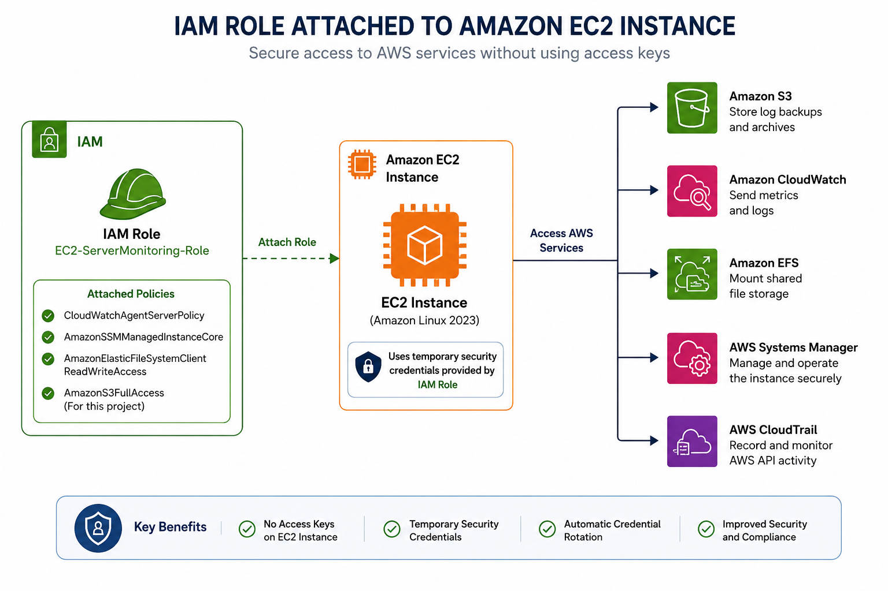

# 🔐 IAM Role Configuration for Amazon EC2

## 📖 Introduction

Identity and Access Management (IAM) is an AWS service that enables you to securely manage authentication and authorization for AWS resources.

In this project, an **IAM Role** is assigned to the Amazon EC2 instance, allowing it to securely access other AWS services such as Amazon S3, Amazon CloudWatch, and Amazon EFS without storing AWS access keys on the server.

Using IAM Roles is an AWS security best practice because temporary credentials are automatically managed by AWS.

---

# 🎯 Objective

The objective of this document is to:

- Create an IAM Role for Amazon EC2
- Attach the required AWS managed policies
- Follow the Principle of Least Privilege
- Securely enable EC2 to interact with AWS services
- Verify the IAM Role configuration

---

# 🏗️ Architecture

<div align="center">



<br>

**Figure 1:** IAM Role attached to an Amazon EC2 instance for secure AWS service access.

</div>

---

# ❓ Why Use IAM Roles Instead of Access Keys?

❌ Do NOT store AWS Access Keys on EC2 instances.

Instead, assign an IAM Role.

Benefits include:

- Temporary security credentials
- Automatic credential rotation
- No hardcoded secrets
- Improved security
- Easier permission management

---

# 🛠️ AWS Services Accessed by This Role

| AWS Service | Purpose |
|-------------|---------|
| Amazon S3 | Upload application log backups |
| Amazon CloudWatch | Publish metrics and logs |
| Amazon EFS | Mount shared file storage |
| AWS Systems Manager | Secure instance management |

---

# 📋 IAM Role Details

| Setting | Value |
|---------|-------|
| Role Name | EC2-ServerMonitoring-Role |
| Trusted Entity | AWS Service |
| Service | EC2 |

---

# 🔑 IAM Policies

Attach the following AWS managed policies:

| Policy | Purpose |
|----------|----------|
| CloudWatchAgentServerPolicy | Send metrics and logs to CloudWatch |
| AmazonSSMManagedInstanceCore | Systems Manager access |
| AmazonElasticFileSystemClientReadWriteAccess | Access Amazon EFS |
| AmazonS3FullAccess* | Upload log backups to S3 |

> **Note:** For production environments, replace `AmazonS3FullAccess` with a custom least-privilege policy that grants access only to the required S3 bucket.

---

# 🚀 Implementation Steps

## Step 1 — Open IAM Console

1. Sign in to the AWS Management Console.
2. Search for **IAM**.
3. Open the IAM Dashboard.

📸 Screenshot:

```
screenshots/IAM/01-iam-dashboard.png
```

---

## Step 2 — Create a New Role

1. Select **Roles**.
2. Click **Create role**.

📸 Screenshot:

```
screenshots/IAM/02-create-role.png
```

---

## Step 3 — Select Trusted Entity

- Trusted Entity Type: **AWS Service**
- Use Case: **EC2**

Click **Next**.

📸 Screenshot:

```
screenshots/IAM/03-trusted-entity.png
```

---

## Step 4 — Attach Permissions

Select the following policies:

- CloudWatchAgentServerPolicy
- AmazonSSMManagedInstanceCore
- AmazonElasticFileSystemClientReadWriteAccess
- AmazonS3FullAccess

Click **Next**.

📸 Screenshot:

```
screenshots/IAM/04-policies.png
```

---

## Step 5 — Configure Role

Role Name:

```
EC2-ServerMonitoring-Role
```

Description:

```
IAM Role for AWS Project 1 Server Monitoring & Log Backup System
```

Click **Create Role**.

📸 Screenshot:

```
screenshots/IAM/05-role-created.png
```

---

# ✅ Verification

Open:

IAM → Roles → EC2-ServerMonitoring-Role

Verify:

- Trusted Entity is EC2
- All required policies are attached
- Role status is active

---

# 💻 AWS CLI Verification

After attaching the role to the EC2 instance:

```bash
curl http://169.254.169.254/latest/meta-data/iam/security-credentials/
```

Expected output:

```text
EC2-ServerMonitoring-Role
```

---

# 🔒 Security Best Practices

- Never use the root account for daily operations.
- Follow the Principle of Least Privilege.
- Avoid storing AWS Access Keys on EC2 instances.
- Use IAM Roles for AWS service access.
- Enable Multi-Factor Authentication (MFA) for IAM users.
- Regularly review IAM permissions.

---

# 🧪 Testing

After launching the EC2 instance with this IAM Role:

- Verify CloudWatch Agent can publish metrics.
- Verify log uploads to Amazon S3.
- Verify EFS can be mounted.
- Verify Systems Manager connectivity (if configured).

---

# 📚 Key Takeaways

- IAM Roles provide secure, temporary AWS credentials.
- EC2 instances should use IAM Roles instead of access keys.
- AWS managed policies simplify initial setup.
- Least-privilege permissions improve overall security.

---

# 📖 Next Step

The next step is to create an Amazon S3 bucket that will store:

- CloudTrail logs
- Apache log backups
- System log backups
- Archived files

➡️ Continue with **04-S3.md**.
