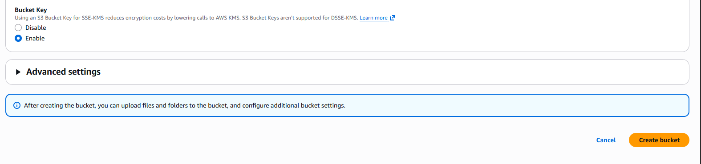
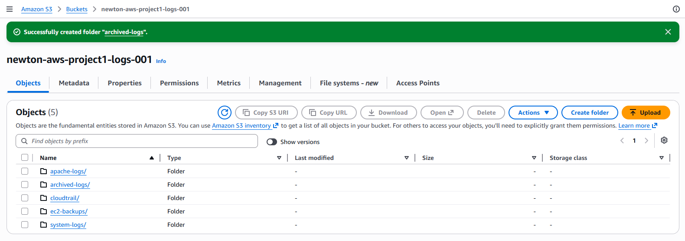
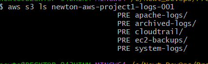

# 🪣 Amazon S3 Configuration for AWS Project 1

## 📖 Introduction

Amazon Simple Storage Service (Amazon S3) is a highly scalable, durable, and secure object storage service provided by AWS. It enables you to store and retrieve any amount of data from anywhere.

In this project, Amazon S3 serves as the centralized storage solution for CloudTrail audit logs, Apache web server log backups, Linux system log backups, and archived application files.

---

# 🎯 Objectives

After completing this guide, you will be able to:

* Create a secure Amazon S3 bucket
* Configure bucket security
* Enable bucket versioning
* Configure default server-side encryption
* Organize objects using folders (prefixes)
* Upload and download files
* Verify bucket configuration
* Manage the bucket using the AWS CLI

---

# 🏗️ Architecture Diagram

<div align="center">


<br>

<p><strong>Figure 1:</strong> Amazon S3 Architecture for AWS Project 1</p>

</div>

---

# ❓ Why Amazon S3?

Amazon S3 is used because it provides:

* Highly durable object storage (99.999999999%)
* Unlimited scalability
* High availability
* Bucket versioning
* Server-side encryption
* Lifecycle management
* Seamless integration with AWS services

---

# 📦 Bucket Configuration

| Setting             | Value                                                                  |
| ------------------- | ---------------------------------------------------------------------- |
| Bucket Name         | `newton-aws-project1-logs-001` *(replace with a globally unique name)* |
| Bucket Type         | General Purpose                                                        |
| AWS Region          | Same Region as EC2                                                     |
| Object Ownership    | Bucket owner enforced                                                  |
| ACLs                | Disabled                                                               |
| Block Public Access | Enabled                                                                |
| Bucket Versioning   | Enabled                                                                |
| Default Encryption  | SSE-S3 (AES-256)                                                       |

---

# 📂 Folder Structure

```text
newton-aws-project1-logs-001/
│
├── cloudtrail/
├── apache-logs/
├── system-logs/
├── ec2-backups/
└── archived-logs/
```

---

# 🚀 AWS Console Implementation

## Step 1 – Open Amazon S3

1. Sign in to the AWS Management Console.
2. Search for **S3**.
3. Open the Amazon S3 Dashboard.

<div align="center">


<br>

<p><strong>Figure 2:</strong> Amazon S3 Dashboard</p>

</div>

---

## Step 2 – Create a New Bucket

1. Click **Create bucket**.
2. Enter a globally unique bucket name.
3. Select your preferred AWS Region.
4. Keep **ACLs disabled**.
5. Keep **Block all public access** enabled.

<div align="center">


<br>

<p><strong>Figure 3:</strong> Create Amazon S3 Bucket</p>

</div>

---

## Step 3 – Enable Bucket Versioning

1. Scroll to **Bucket Versioning**.
2. Select **Enable**.

<div align="center">


<br>

<p><strong>Figure 4:</strong> Enable Bucket Versioning</p>

</div>

---

## Step 4 – Configure Default Encryption

1. Scroll to **Default Encryption**.
2. Select **Server-side encryption with Amazon S3 managed keys (SSE-S3)**.

<div align="center">


<br>

<p><strong>Figure 5:</strong> Configure Default Encryption</p>

</div>

---

## Step 5 – Create the Bucket

After reviewing all configuration settings:

* Bucket Name
* AWS Region
* Public Access Settings
* Bucket Versioning
* Default Encryption

Click the **Create bucket** button.

AWS will create the bucket and redirect you to the S3 Buckets page.

<div align="center">



<br>

<p><strong>Figure 6:</strong> Amazon S3 Bucket Created Successfully</p>

</div>

---

## Step 6 – Create Folder Structure

Open the bucket and create the following folders:

* `cloudtrail/`
* `apache-logs/`
* `system-logs/`
* `ec2-backups/`
* `archived-logs/`

<div align="center">



<br>

<p><strong>Figure 7:</strong> Amazon S3 Folder Structure</p>

</div>

---

## Step 7 – Verify Bucket Properties

Verify the following:

* Block Public Access: Enabled
* Versioning: Enabled
* Default Encryption: Enabled
* Bucket Owner Enforced

<div align="center">



<br>

<p><strong>Figure 8:</strong> Amazon S3 Bucket Properties</p>

</div>

---

# 💻 AWS CLI Commands

## Verify AWS CLI

```bash
aws --version
```

---

## List Existing Buckets

```bash
aws s3 ls
```

---

## Create a Bucket

```bash
aws s3api create-bucket \
  --bucket newton-aws-project1-logs-001 \
  --region ap-south-1 \
  --create-bucket-configuration LocationConstraint=ap-south-1
```

---

## Enable Bucket Versioning

```bash
aws s3api put-bucket-versioning \
  --bucket newton-aws-project1-logs-001 \
  --versioning-configuration Status=Enabled
```

---

## Enable Server-Side Encryption

```bash
aws s3api put-bucket-encryption \
  --bucket newton-aws-project1-logs-001 \
  --server-side-encryption-configuration '{
    "Rules":[
      {
        "ApplyServerSideEncryptionByDefault":{
          "SSEAlgorithm":"AES256"
        }
      }
    ]
  }'
```

---

## Upload a File

```bash
aws s3 cp test.txt s3://newton-aws-project1-logs-001/system-logs/
```

---

## List Bucket Contents

```bash
aws s3 ls s3://newton-aws-project1-logs-001/
```

---

## Download a File

```bash
aws s3 cp s3://newton-aws-project1-logs-001/system-logs/test.txt .
```

---

## Synchronize a Directory

```bash
aws s3 sync /var/log/ s3://newton-aws-project1-logs-001/system-logs/
```

---

# ✅ Verification Checklist

* Bucket created successfully
* Public access blocked
* Versioning enabled
* Server-side encryption enabled
* Folder structure created
* File upload tested
* File download tested

---

# 🔒 Security Best Practices

* Block all public access.
* Enable bucket versioning.
* Enable server-side encryption.
* Use IAM Roles instead of access keys.
* Grant only the required permissions.
* Enable CloudTrail logging.
* Review bucket permissions regularly.

---

# 🧪 Testing

Create a sample file:

```bash
echo "AWS Project 1 Test File" > test.txt
```

Upload it:

```bash
aws s3 cp test.txt s3://newton-aws-project1-logs-001/system-logs/
```

Verify:

```bash
aws s3 ls s3://newton-aws-project1-logs-001/system-logs/
```

---

# 🐞 Troubleshooting

| Issue                      | Solution                                             |
| -------------------------- | ---------------------------------------------------- |
| Bucket name already exists | Use a globally unique bucket name                    |
| AccessDenied               | Verify IAM permissions and bucket policy             |
| Upload failed              | Check AWS CLI configuration and network connectivity |
| Versioning disabled        | Enable versioning in bucket properties               |

---

# 📚 Key Takeaways

* Amazon S3 provides secure, scalable, and durable object storage.
* Bucket versioning protects against accidental deletion and overwrites.
* Server-side encryption secures data at rest.
* S3 integrates seamlessly with CloudTrail and EC2.
* Organized prefixes simplify backup and log management.

---

# 📖 Next Step

The next guide is **05-CloudTrail.md**, where you will configure AWS CloudTrail to record all AWS API activity and deliver audit logs to this Amazon S3 bucket.

