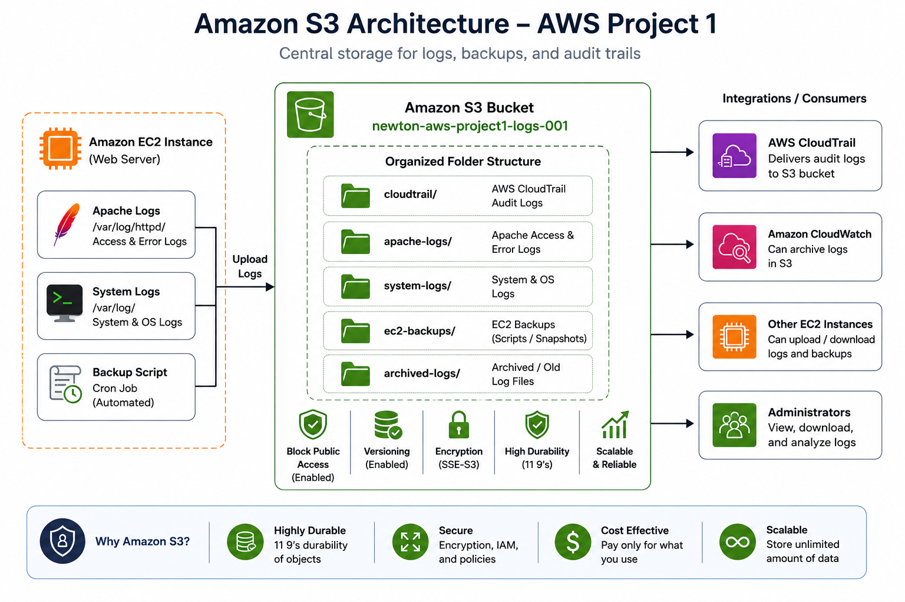
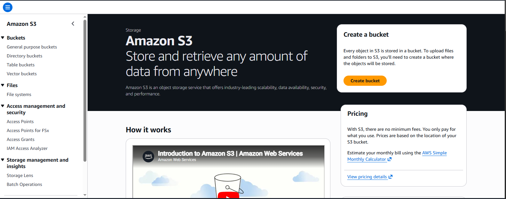
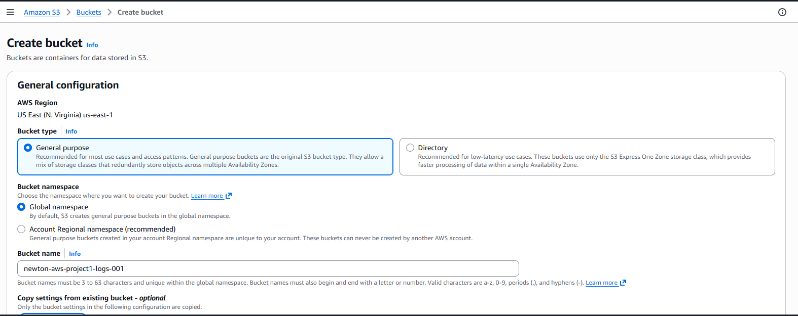
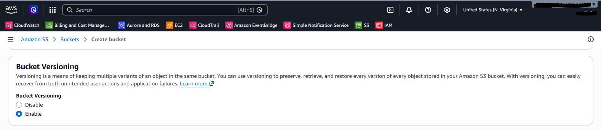
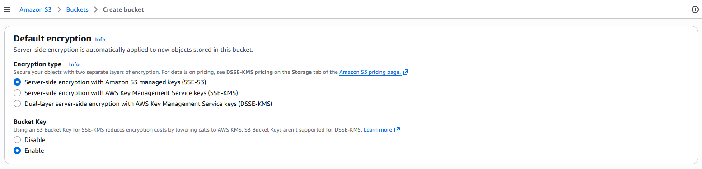

# Amazon S3 Configuration — AWS Project 1

## Introduction

Amazon Simple Storage Service (Amazon S3) is a highly durable, scalable, and secure object storage service provided by AWS. It is commonly used to store application data, backups, log files, static website assets, and audit logs.

In this project, Amazon S3 serves as the central storage location for CloudTrail logs, application log backups, and archived system logs. By keeping backups in S3, we ensure data durability and support disaster recovery.

---

## Objectives

- Create a secure Amazon S3 bucket
- Enable bucket versioning
- Configure server-side encryption
- Store CloudTrail audit logs
- Store automated Apache and system log backups
- Verify bucket functionality using both the AWS Console and AWS CLI

---

## Architecture



> **Figure 1:** Amazon S3 storing CloudTrail logs and EC2 application backups.

---

## Why Amazon S3?

Amazon S3 is used because it provides:

- Highly durable object storage (11 nines of durability)
- High availability and scalability
- Secure storage with encryption
- Lifecycle management
- Versioning for data protection
- Integration with many AWS services

---

## Bucket Details

| Setting            | Value                                                                   |
|--------------------|-------------------------------------------------------------------------|
| Bucket Name        | `newton-aws-project1-logs-001` *(replace with a globally unique name)*  |
| Region             | Same AWS Region as EC2                                                  |
| Bucket Type        | General Purpose                                                         |
| Public Access      | Block all public access                                                 |
| Versioning         | Enabled                                                                 |
| Default Encryption | SSE-S3                                                                  |
| Object Ownership   | Bucket owner enforced (ACLs disabled)                                   |

---

## Folder Structure

Organize objects using prefixes (folders):

```
newton-aws-project1-logs-001/
│
├── cloudtrail/
├── apache-logs/
├── system-logs/
├── ec2-backups/
└── archived-logs/
```

---

## AWS Console Implementation

### Step 1 — Open Amazon S3

1. Sign in to the AWS Management Console.
2. Search for **S3**.
3. Open the Amazon S3 Console.



> **Figure 1:** Amazon S3 Dashboard

---

### Step 2 — Create Bucket

1. Click **Create bucket**.
2. Enter a globally unique bucket name.
3. Select the same Region as your EC2 instance.
4. Keep **ACLs disabled**.
5. Keep **Block all public access** enabled.



> **Figure 2:** Create Amazon S3 Bucket

---

### Step 3 — Enable Versioning

1. Scroll to **Bucket Versioning**.
2. Select **Enable**.



> **Figure 3:** Enable Bucket Versioning

---

### Step 4 — Enable Default Encryption

1. Under **Default Encryption**, choose:
   - **Server-side encryption with Amazon S3 managed keys (SSE-S3)**
2. Click **Create bucket**.



> **Figure 4:** Configure Default Bucket Encryption

---

### Step 5 — Create Folder Structure

Inside the bucket, create the following folders:

- `cloudtrail/`
- `apache-logs/`
- `system-logs/`
- `ec2-backups/`
- `archived-logs/`


> **Figure 5:** Amazon S3 Folder Structure

---

## AWS CLI Commands

### Verify AWS CLI

```bash
aws --version
```

---

### List Existing Buckets

```bash
aws s3 ls
```

---

### Create a Bucket

> Replace the bucket name with your own globally unique name.

```bash
aws s3 mb s3://newton-aws-project1-logs-001
```

For regions other than `us-east-1`:

```bash
aws s3api create-bucket \
  --bucket newton-aws-project1-logs-001 \
  --region ap-south-1 \
  --create-bucket-configuration LocationConstraint=ap-south-1
```

---

### Enable Bucket Versioning

```bash
aws s3api put-bucket-versioning \
  --bucket newton-aws-project1-logs-001 \
  --versioning-configuration Status=Enabled
```

---

### Enable Default Encryption

```bash
aws s3api put-bucket-encryption \
  --bucket newton-aws-project1-logs-001 \
  --server-side-encryption-configuration '{
    "Rules": [
      {
        "ApplyServerSideEncryptionByDefault": {
          "SSEAlgorithm": "AES256"
        }
      }
    ]
  }'
```

---

### Upload a File

```bash
aws s3 cp backup.tar.gz s3://newton-aws-project1-logs-001/ec2-backups/
```

---

### List Bucket Contents

```bash
aws s3 ls s3://newton-aws-project1-logs-001/
```

---

### Download a File

```bash
aws s3 cp s3://newton-aws-project1-logs-001/ec2-backups/backup.tar.gz .
```

---

### Sync a Directory

```bash
aws s3 sync /var/log/ s3://newton-aws-project1-logs-001/system-logs/
```

---

## Verification

Confirm all of the following are in place:

- [ ] Bucket created successfully
- [ ] Public access is blocked
- [ ] Versioning is enabled
- [ ] Default encryption is enabled
- [ ] Folder structure exists
- [ ] File upload and download work correctly

---

## Security Best Practices

- Block all public access unless explicitly required.
- Enable bucket versioning to protect against accidental deletion.
- Enable server-side encryption (SSE-S3 or SSE-KMS).
- Follow the **Principle of Least Privilege** for IAM permissions.
- Use bucket policies instead of broad IAM permissions where possible.
- Enable CloudTrail logging for bucket activity.

---

## Testing

Upload a sample file:

```bash
echo "AWS Project 1 Test File" > test.txt
aws s3 cp test.txt s3://newton-aws-project1-logs-001/system-logs/
```

Verify the upload:

```bash
aws s3 ls s3://newton-aws-project1-logs-001/system-logs/
```

---

## Troubleshooting

| Issue                      | Solution                                              |
|----------------------------|-------------------------------------------------------|
| Bucket name already exists | Choose a globally unique bucket name                  |
| `AccessDenied`             | Verify IAM permissions or bucket policy               |
| Upload failed              | Check network connectivity and AWS CLI configuration  |
| Versioning not enabled     | Verify bucket versioning settings in the console      |

---

## Key Takeaways

- Amazon S3 provides secure and durable object storage.
- Bucket versioning protects against accidental overwrites and deletions.
- Server-side encryption secures stored objects at rest.
- S3 integrates seamlessly with CloudTrail, EC2, and backup automation.
- Organizing objects with prefixes (folders) simplifies log management.

---

## Next Step

The next step is to configure **AWS CloudTrail** to record all AWS API activity and deliver audit logs to the S3 bucket created in this document.

➡️ Continue with [**05-CloudTrail.md**](./05-CloudTrail.md)