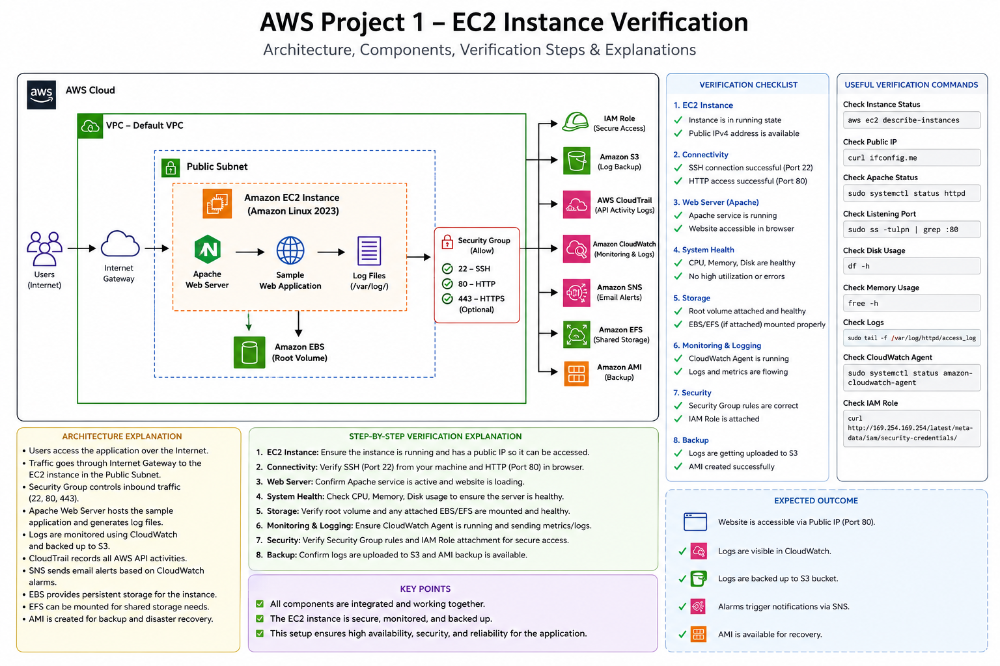

# Amazon EC2

> **Project:** AWS Project 1 – Server Monitoring & Log Backup System

---

# Amazon EC2

> **Project:** AWS Project 1 – Server Monitoring & Log Backup System

---

# EC2 Architecture and Verification

The following diagram illustrates the complete Amazon EC2 architecture used in this project. It shows how the EC2 instance integrates with other AWS services such as IAM, Amazon S3, AWS CloudTrail, Amazon CloudWatch, Amazon SNS, Amazon EBS, Amazon EFS, and Amazon AMI.

The diagram also includes the verification checklist, useful Linux commands, expected outcomes, and the complete request flow from users to the web application.

<p align="center">
  
</p>

---

## Architecture Explanation

The EC2 instance is the central component of this project. It hosts the sample web application and communicates with multiple AWS services to provide monitoring, logging, storage, security, backup, and notification capabilities.

### Components

### 🌐 Internet

Users access the application through a public URL using HTTP or HTTPS.

↓

### 🌍 Internet Gateway

The Internet Gateway enables communication between the public internet and the Virtual Private Cloud (VPC).

↓

### ☁️ Amazon VPC

The EC2 instance is deployed inside the default Amazon VPC, which provides network isolation and secure communication.

↓

### 📡 Public Subnet

The EC2 instance resides in a public subnet with an assigned public IPv4 address, allowing administrators to connect using SSH and users to access the web application.

↓

### 🖥 Amazon EC2 Instance

The EC2 instance runs Amazon Linux 2023 and hosts:

* Apache Web Server
* Sample Web Application
* System Logs
* Monitoring Scripts

It serves as the primary compute resource for the entire project.

---

## Security Group

The Security Group acts as a virtual firewall protecting the EC2 instance.

Configured inbound rules:

| Port | Protocol | Purpose            |
| ---- | -------- | ------------------ |
| 22   | TCP      | SSH Administration |
| 80   | TCP      | HTTP Web Traffic   |
| 443  | TCP      | HTTPS (Optional)   |

---

## IAM Role

An IAM Role is attached to the EC2 instance to provide secure access to AWS services without storing access keys on the server.

The IAM Role is used for:

* Amazon S3 access
* CloudWatch Agent
* CloudTrail integration
* Future automation tasks

---

## Amazon S3

Amazon S3 is used to store:

* Application logs
* Backup files
* Archived data

This provides durable and highly available storage for project artifacts.

---

## AWS CloudTrail

CloudTrail records all AWS API activities performed on the EC2 instance and other AWS resources.

Examples include:

* Instance launch
* Instance stop/start
* IAM Role attachment
* Security Group changes

These logs help with auditing and security investigations.

---

## Amazon CloudWatch

CloudWatch continuously monitors the EC2 instance by collecting metrics and logs.

Metrics include:

* CPU Utilization
* Memory Usage
* Disk Usage
* Network Traffic

CloudWatch provides operational visibility into the health of the server.

---

## Amazon SNS

CloudWatch Alarms trigger Amazon SNS notifications whenever configured thresholds are exceeded.

Example alerts include:

* High CPU utilization
* Low disk space
* Instance health issues

Notifications are delivered via email.

---

## Amazon EBS

Amazon EBS provides persistent block storage for the EC2 instance.

The root volume stores:

* Operating System
* Installed software
* Application files
* Configuration data

Additional EBS volumes can be attached as the project grows.

---

## Amazon EFS

Amazon EFS provides a shared file system that can be mounted by one or more EC2 instances.

This service is useful for:

* Shared application data
* Centralized storage
* Multi-instance environments

---

## Amazon AMI

Amazon Machine Images (AMI) are used to create complete backups of the EC2 instance.

An AMI includes:

* Operating System
* Installed packages
* Configuration
* Application files

It can be used to quickly restore or clone the server.

---

# Verification Checklist

After completing the EC2 setup, verify the following:

* Instance is in the **Running** state.
* Public IPv4 address is assigned.
* SSH connection is successful.
* Apache Web Server is running.
* The sample web application is accessible.
* Security Group rules are correctly configured.
* IAM Role is attached.
* Root EBS volume is healthy.
* CloudWatch Agent is operational (after installation).
* Log files are being generated.

---

# Expected Outcome

After completing all EC2 configuration steps:

* The web application is accessible through the EC2 Public IP.
* Apache Web Server is running successfully.
* The EC2 instance is securely configured.
* The server is ready for integration with IAM, Amazon S3, AWS CloudTrail, Amazon CloudWatch, Amazon SNS, Amazon EBS, Amazon EFS, and Amazon AMI.
* The environment is prepared for the remaining phases of the **AWS Project 1 – Server Monitoring & Log Backup System**.


---
# Amazon EC2 (Elastic Compute Cloud)

## Project Overview

Amazon Elastic Compute Cloud (EC2) is the primary compute service in Amazon Web Services (AWS). It allows users to launch virtual servers, known as **EC2 Instances**, in the cloud. These instances provide scalable, secure, and on-demand computing resources without requiring organizations to purchase or maintain physical servers.

In this project, the EC2 instance acts as the central server where the sample web application is hosted. It also serves as the primary compute resource for monitoring, logging, backup, storage integration, and automation using other AWS services.

This document explains how the EC2 instance is created, configured, secured, and prepared for the remaining phases of the **AWS Project 1 – Server Monitoring & Log Backup System**.

---

## Project Objective

The objective of using Amazon EC2 in this project is to create a Linux-based server that can host a sample web application while integrating with multiple AWS services.

After completing the EC2 setup, the instance will be used to:

* Host a sample Apache web application.
* Attach an IAM Role for secure AWS access.
* Upload and retrieve log files from Amazon S3.
* Record AWS API activities using CloudTrail.
* Monitor CPU, memory, disk, and logs using CloudWatch.
* Generate alerts using Amazon SNS.
* Attach additional Amazon EBS volumes.
* Mount an Amazon EFS file system.
* Create Amazon Machine Images (AMI) for backup and recovery.
* Execute automation scripts for server administration.

The EC2 instance serves as the foundation for every service implemented in this project.

---

## What is Amazon EC2?

Amazon Elastic Compute Cloud (Amazon EC2) is an Infrastructure as a Service (IaaS) offering provided by AWS. It enables users to provision virtual machines within minutes and configure them according to application requirements.

Unlike traditional physical servers, EC2 instances can be launched, resized, stopped, started, or terminated whenever needed. This flexibility enables organizations to scale infrastructure dynamically while paying only for the resources consumed.

Each EC2 instance behaves like a physical computer where users have full control over:

* Operating System
* Installed Software
* Application Configuration
* Networking
* Storage
* Security
* Monitoring

AWS manages the underlying physical infrastructure, while customers manage the operating system and applications running inside the instance.

---

## Why Amazon EC2?

Before cloud computing became popular, organizations had to purchase expensive hardware, configure data centers, and wait days or weeks before new servers became available.

Amazon EC2 eliminates these challenges by allowing servers to be created within minutes.

Benefits include:

* On-demand server provisioning
* Elastic scalability
* High availability
* Secure networking
* Global deployment
* Pay-as-you-go pricing
* Easy integration with AWS services

These capabilities make EC2 one of the most widely used cloud computing services.

---

## EC2 Architecture in This Project

The following diagram represents the logical architecture of the EC2 instance within this project.

```text
                        Internet
                            │
                            │
                     Security Group
                            │
                            ▼
                  +----------------------+
                  |   Amazon EC2         |
                  | Amazon Linux 2023    |
                  | Apache Web Server    |
                  | Sample Web App       |
                  +----------------------+
                     │      │       │
        ┌────────────┘      │       └──────────────┐
        ▼                   ▼                      ▼
   IAM Role           Amazon S3             CloudWatch
 Secure Access        Log Backup        Metrics & Logs
        │                                      │
        │                                      ▼
        │                                 CloudWatch
        │                                   Alarms
        │                                      │
        ▼                                      ▼
   CloudTrail -----------------------------> Amazon SNS
  API Activity Logs                     Email Notifications

                     │
                     ▼
               Amazon EBS Volume

                     │
                     ▼
               Amazon EFS File System

                     │
                     ▼
                 Amazon AMI Backup
```

---

## EC2 Workflow in This Project

The EC2 instance is configured using the following workflow:

1. Launch an Amazon EC2 instance.
2. Configure networking using a Virtual Private Cloud (VPC).
3. Create and attach a Security Group.
4. Create a Key Pair for SSH authentication.
5. Connect to the instance using SSH.
6. Update the operating system.
7. Install Apache Web Server.
8. Deploy a sample web application.
9. Attach an IAM Role.
10. Configure CloudTrail.
11. Configure CloudWatch Agent.
12. Upload log files to Amazon S3.
13. Create CloudWatch alarms.
14. Send notifications through Amazon SNS.
15. Attach Amazon EBS storage.
16. Mount Amazon EFS.
17. Create an AMI backup.
18. Perform testing and validation.

Each subsequent document in this repository builds upon this EC2 instance.

---

## Prerequisites

Before launching an EC2 instance, ensure the following requirements are met.

### AWS Account

An active AWS account with permissions to create EC2 resources.

### AWS Region

Select a region close to your users or learning environment.

Example:

```
Asia Pacific (Mumbai)
ap-south-1
```

### IAM Permissions

The user should have permissions to:

* Launch EC2 instances
* Create Security Groups
* Create Key Pairs
* Attach IAM Roles
* Create EBS Volumes
* Create AMIs

### Key Pair

A Key Pair is required for secure SSH access to Linux instances. The private key (`.pem`) should be stored securely and must never be shared publicly.

### Security Group

A Security Group acts as a virtual firewall that controls inbound and outbound traffic.

For this project, the following inbound rules are required:

| Port | Protocol | Purpose              |
| ---- | -------- | -------------------- |
| 22   | TCP      | SSH Access           |
| 80   | TCP      | HTTP Web Application |
| 443  | TCP      | HTTPS (Optional)     |

### Network Requirements

The EC2 instance should be launched within:

* Default or Custom VPC
* Public Subnet
* Internet Gateway attached
* Public IPv4 Address enabled

This configuration allows administrators to connect to the instance using SSH and access the hosted web application from the internet.

---

## EC2 Configuration Used in This Project

The following configuration is recommended for this project.

| Setting          | Value                         |
| ---------------- | ----------------------------- |
| Operating System | Amazon Linux 2023             |
| Instance Type    | t2.micro (Free Tier Eligible) |
| Architecture     | x86_64                        |
| Root Volume      | 8 GB gp3                      |
| Network          | Default VPC                   |
| Public IP        | Enabled                       |
| Authentication   | SSH Key Pair                  |
| Web Server       | Apache (httpd)                |
| Storage          | Amazon EBS                    |
| Monitoring       | Amazon CloudWatch             |
| Backup           | Amazon S3 & Amazon AMI        |

---

## Learning Outcomes

After completing the EC2 section of this project, you will be able to:

* Launch and configure an EC2 instance.
* Connect securely using SSH.
* Configure networking and Security Groups.
* Install and manage software packages.
* Deploy a web application.
* Integrate EC2 with IAM, S3, CloudTrail, CloudWatch, SNS, EBS, EFS, and AMI.
* Follow AWS security and operational best practices.
* Build a production-style cloud server suitable for monitoring and automation.

---

# Part 2: Server Setup and Configuration

After successfully launching the Amazon EC2 instance and connecting via SSH, the next step is to prepare the server for hosting the sample web application and integrating it with other AWS services.

The server setup process includes:

* Updating the operating system
* Installing required software packages
* Configuring Apache Web Server
* Creating the project directory structure
* Deploying the sample web application
* Verifying the web server
* Preparing the instance for CloudWatch, CloudTrail, S3, EBS, EFS, SNS, and AMI integration

---

## Step 1: Connect to the EC2 Instance

Connect to your EC2 instance using SSH.

```bash
ssh -i "your-key.pem" ec2-user@<Public-IP>
```

Example:

```bash
ssh -i "aws-project.pem" ec2-user@13.234.xxx.xxx
```

After successful login, you should see a prompt similar to:

```bash
[ec2-user@ip-172-31-xx-xx ~]$
```

---

## Step 2: Verify the Operating System

Check the operating system version.

```bash
cat /etc/os-release
```

Example Output:

```text
NAME="Amazon Linux"
VERSION="2023"
ID="amzn"
```

Verify the kernel version.

```bash
uname -r
```

Check the system architecture.

```bash
uname -m
```

Expected Output:

```text
x86_64
```

---

## Step 3: Update the Operating System

Updating the operating system ensures the latest security patches and package updates are installed before deploying applications.

Update all packages.

```bash
sudo dnf update -y
```

Clean unused packages.

```bash
sudo dnf autoremove -y
```

Refresh package metadata.

```bash
sudo dnf clean all
```

---

## Step 4: Install Required Packages

Install common utilities that will be used throughout the project.

```bash
sudo dnf install -y \
git \
wget \
curl \
tree \
zip \
unzip \
vim \
nano \
tar
```

Verify installation.

```bash
git --version
tree --version
wget --version
```

---

## Step 5: Install Apache Web Server

Install Apache (httpd).

```bash
sudo dnf install httpd -y
```

Start the Apache service.

```bash
sudo systemctl start httpd
```

Enable Apache to start automatically after every reboot.

```bash
sudo systemctl enable httpd
```

Verify the service status.

```bash
sudo systemctl status httpd
```

Expected Status:

```text
Active: active (running)
```

---

## Step 6: Configure the Firewall (Security Group)

Ensure the EC2 Security Group allows:

| Port | Protocol | Purpose          |
| ---- | -------- | ---------------- |
| 22   | TCP      | SSH Access       |
| 80   | TCP      | HTTP             |
| 443  | TCP      | HTTPS (Optional) |

No operating system firewall configuration is required for Amazon Linux unless additional firewall software is installed.

---

## Step 7: Create the Project Directory

Create a directory to organize project files.

```bash
mkdir -p ~/aws-project
```

Navigate to the project directory.

```bash
cd ~/aws-project
```

Create subdirectories.

```bash
mkdir logs backups scripts temp
```

Verify the directory structure.

```bash
tree
```

Expected Output:

```text
.
├── backups
├── logs
├── scripts
└── temp
```

---

## Step 8: Deploy the Sample Web Application

Move to the Apache document root.

```bash
cd /var/www/html
```

Create a simple HTML page.

```bash
sudo tee index.html > /dev/null <<EOF
<!DOCTYPE html>
<html>
<head>
    <title>AWS Project 1</title>
</head>
<body>
    <h1>Welcome to AWS Project 1</h1>
    <p>Server Monitoring & Log Backup System</p>
    <p>Hosted on Amazon EC2</p>
</body>
</html>
EOF
```

Restart Apache.

```bash
sudo systemctl restart httpd
```

---

## Step 9: Verify the Web Application

Retrieve the EC2 Public IPv4 address from the AWS Management Console.

Open a web browser and navigate to:

```text
http://<Public-IP>
```

Example:

```text
http://13.234.xxx.xxx
```

If the deployment is successful, the browser should display:

```text
Welcome to AWS Project 1
Server Monitoring & Log Backup System
Hosted on Amazon EC2
```

---

## Step 10: Verify Server Health

Check disk usage.

```bash
df -h
```

Check memory usage.

```bash
free -h
```

Check CPU information.

```bash
lscpu
```

Check uptime.

```bash
uptime
```

Check hostname.

```bash
hostname
```

Check the private IP address.

```bash
hostname -I
```

---

## Step 11: Verify Apache Service

Check the service status.

```bash
sudo systemctl status httpd
```

View listening ports.

```bash
sudo ss -tulpn
```

Verify Apache is listening on port 80.

```bash
sudo ss -tulpn | grep :80
```

---

## Project Directory Structure

The server now contains the following project structure.

```text
/home/ec2-user/aws-project/
├── backups/
├── logs/
├── scripts/
└── temp/
```

The Apache web content is stored in:

```text
/var/www/html/
└── index.html
```

---

## Useful Linux Commands

| Command                   | Description                 |
| ------------------------- | --------------------------- |
| `pwd`                     | Display current directory   |
| `ls -la`                  | List files with details     |
| `cd`                      | Change directory            |
| `mkdir`                   | Create a directory          |
| `cp`                      | Copy files                  |
| `mv`                      | Move or rename files        |
| `rm -rf`                  | Remove files or directories |
| `tree`                    | Display directory structure |
| `cat`                     | View file contents          |
| `nano`                    | Edit files                  |
| `vim`                     | Edit files                  |
| `systemctl status httpd`  | Check Apache status         |
| `systemctl restart httpd` | Restart Apache              |
| `journalctl -xe`          | View system logs            |
| `df -h`                   | Display disk usage          |
| `free -h`                 | Display memory usage        |
| `top`                     | Monitor running processes   |
| `hostname -I`             | Display IP address          |

---

## Validation Checklist

Verify the following before continuing to the next phase:

* ✅ Successfully connected to the EC2 instance.
* ✅ Operating system updated.
* ✅ Required packages installed.
* ✅ Apache Web Server installed.
* ✅ Apache service started and enabled.
* ✅ Project directory created.
* ✅ Sample web application deployed.
* ✅ Web application accessible through the Public IP.
* ✅ Server health verified.
* ✅ EC2 instance ready for IAM, S3, CloudTrail, CloudWatch, SNS, EBS, EFS, and AMI integration.

---

## Summary

At this stage, the EC2 instance is fully prepared for the remaining components of the project. The operating system has been updated, essential utilities have been installed, Apache Web Server is running, a sample web application has been deployed, and the server has been validated. This configured instance will serve as the foundation for implementing IAM Roles, CloudTrail, CloudWatch, SNS, EBS, EFS, AMI, and automated log backup in the next phases of the project.

---

# Part 3: Best Practices, Cost Optimization & Troubleshooting

## Best Practices

Following AWS best practices helps improve the security, availability, performance, and cost efficiency of your EC2 instances. The recommendations below are applicable to both this project and production environments.

### 1. Use IAM Roles Instead of Access Keys

Never store AWS Access Keys directly on an EC2 instance.

**Recommended Approach:**

* Create an IAM Role.
* Attach the role to the EC2 instance.
* Grant only the required permissions (Principle of Least Privilege).

**Benefits:**

* Eliminates the need to manage access keys.
* Improves security.
* Credentials are rotated automatically by AWS.

### 2. Secure Your Security Groups

A Security Group acts as a virtual firewall for your EC2 instance.

**Recommendations:**

* Allow only required ports.
* Restrict SSH (Port 22) to trusted IP addresses whenever possible.
* Remove unused inbound rules.
* Regularly review outbound rules.

Example:

| Port | Purpose | Recommendation               |
| ---- | ------- | ---------------------------- |
| 22   | SSH     | Restrict to administrator IP |
| 80   | HTTP    | Allow Internet               |
| 443  | HTTPS   | Allow Internet               |

### 3. Keep the Operating System Updated

Install security updates regularly.

```bash
sudo dnf update -y
```

Benefits:

* Fixes security vulnerabilities
* Improves system stability
* Updates software packages

### 4. Enable Monitoring

Always monitor the health of your EC2 instances.

Recommended services:

* Amazon CloudWatch Metrics
* CloudWatch Agent
* CloudWatch Alarms
* Amazon SNS Notifications

Monitor:

* CPU Utilization
* Memory Usage
* Disk Usage
* Network Traffic
* System Logs

### 5. Enable Logging

Logging is essential for troubleshooting and auditing.

Use:

* AWS CloudTrail
* CloudWatch Logs
* Apache Access Logs
* Apache Error Logs
* Linux System Logs

### 6. Tag AWS Resources

Apply meaningful tags to improve organization and cost tracking.

Example:

| Key         | Value         |
| ----------- | ------------- |
| Project     | AWS Project 1 |
| Environment | Learning      |
| Owner       | Your Name     |
| Service     | EC2           |

### 7. Regular Backups

Never rely on a single server.

Recommended backup methods:

* Amazon Machine Images (AMI)
* Amazon EBS Snapshots
* Amazon S3 Log Backups

### 8. Use Elastic IP Only When Required

Elastic IP addresses are limited resources.

Use them only when:

* A static public IP is required.
* DNS records depend on a fixed IP.

Release unused Elastic IPs to avoid unnecessary charges.

### 9. Follow the Principle of Least Privilege

Grant only the permissions required for the workload. Avoid using `AdministratorAccess` unless absolutely necessary.

### 10. Stop Unused Instances

Running EC2 instances continue to incur charges. Stop development or testing instances when they are not in use.

---

## Cost Optimization

Amazon EC2 pricing is based on resource consumption. Proper planning can significantly reduce costs.

### Use Free Tier Resources

For learning purposes, use `t2.micro` or `t3.micro` (where applicable). These are generally eligible under the AWS Free Tier for new accounts, subject to AWS Free Tier limits.

### Stop Idle Instances

If an instance is not required, stop it to avoid compute charges (although storage charges for EBS volumes continue).

### Delete Unused Resources

Remove resources that are no longer required, such as:

* Unused EBS Volumes
* Unused Snapshots
* Elastic IPs
* Security Groups
* Load Balancers

### Monitor Billing

Use the AWS Console → Billing Dashboard → Cost Explorer to monitor monthly costs, daily usage, and forecasted spending.

### Choose the Correct Instance Type

Do not overprovision resources.

| Workload           | Recommended Instance |
| ------------------ | -------------------- |
| Small web server   | t2.micro             |
| Large database     | R-series             |
| Machine Learning   | GPU Instances        |

### Enable Auto Scaling

Instead of running multiple instances continuously, scale out during high traffic and scale in during low traffic to reduce operational costs.

---

## Real-World Scenario

**Scenario:** A software company hosts an internal employee portal.

**Requirements:**

* 24/7 availability
* Secure remote administration
* Log monitoring
* Daily backups
* Cost-efficient infrastructure

**Solution:** The company launches an Amazon EC2 instance to host the application with the following AWS services integrated:

* IAM Role for secure AWS access
* Amazon S3 for application log backups
* AWS CloudTrail for API activity auditing
* Amazon CloudWatch for server monitoring
* Amazon SNS for email notifications
* Amazon EBS for persistent storage
* Amazon EFS for shared file storage
* Amazon AMI for disaster recovery

**Result:** The organization achieves secure infrastructure, automated monitoring, centralized logging, reliable backups, easy disaster recovery, and lower infrastructure costs. This project demonstrates a similar architecture on a smaller scale, making it an excellent hands-on learning experience.

---

## Common Troubleshooting

### Problem 1: Unable to Connect via SSH

**Possible Causes:**

* Incorrect Security Group
* Wrong Key Pair
* Incorrect Public IP
* Instance is stopped

**Solution:**

* Verify Port 22 is open.
* Check the key pair.
* Confirm the instance is running.
* Verify the public IP.

### Problem 2: Website Not Loading

**Possible Causes:**

* Apache not installed
* Apache service stopped
* Port 80 blocked

Verify:

```bash
sudo systemctl status httpd
```

Restart Apache:

```bash
sudo systemctl restart httpd
```

### Problem 3: Permission Denied

Check file permissions.

```bash
ls -l
```

Modify permissions if required using `chmod` or `chown`.

### Problem 4: Disk Full

Check storage.

```bash
df -h
```

Find large files.

```bash
du -sh *
```

Remove unnecessary files.

### Problem 5: High CPU Utilization

Monitor processes.

```bash
top
```

or

```bash
htop
```

Identify resource-intensive processes and optimize them.

### Problem 6: EC2 Cannot Access AWS Services

Verify the IAM Role via: EC2 → Actions → Security → Modify IAM Role. Confirm the correct role is attached.

---

## Interview Questions

### Basic

1. What is Amazon EC2?
2. What is an EC2 Instance?
3. What are the advantages of EC2?
4. What is an AMI?
5. What is a Security Group?

### Intermediate

6. What is the difference between Stop and Terminate?
7. Explain EC2 Instance Types.
8. What is an Elastic IP?
9. What is User Data?
10. What is an IAM Role?

### Advanced

11. What is Instance Metadata?
12. What is the difference between EBS and Instance Store?
13. How do you secure an EC2 instance?
14. How would you troubleshoot SSH connection issues?
15. How do you reduce EC2 costs?
16. How do you monitor an EC2 instance?
17. Explain Auto Scaling.
18. Explain EC2 pricing models.
19. How would you create an EC2 backup?
20. Explain the architecture of this AWS Project.

---

## Key Takeaways

After completing this section, you should be able to:

* Launch and configure an EC2 instance.
* Connect securely using SSH.
* Install and manage software packages.
* Deploy a web application.
* Configure basic Linux administration.
* Apply AWS security best practices.
* Optimize EC2 costs.
* Troubleshoot common server issues.
* Integrate EC2 with IAM, S3, CloudTrail, CloudWatch, SNS, EBS, EFS, and AMI.

---

## Summary

Amazon EC2 is the foundation of this **AWS Project 1 – Server Monitoring & Log Backup System**. In this project, the EC2 instance serves as the central compute resource for hosting the sample web application and integrating multiple AWS services. The server is configured with secure networking, Apache Web Server, and essential Linux utilities, making it ready for monitoring, logging, storage expansion, backups, and automation.

By following AWS best practices, implementing proper security controls, monitoring system health, and optimizing costs, you can build a reliable and production-ready cloud environment.

---

## Next Steps

The EC2 instance is now fully prepared for the next phases of the project. Continue with the remaining documents in this repository:

* **07-Web-Application.md** – Deploy and manage the sample web application.
* **08-EBS.md** – Attach and configure persistent block storage.
* **09-EFS.md** – Configure shared file storage.
* **10-CloudWatch.md** – Monitor instance metrics and logs.
* **11-CloudWatch-Alarms.md** – Create alarms for system monitoring.
* **12-SNS.md** – Configure email notifications.
* **13-AMI.md** – Create machine images for backup and disaster recovery.
* **14-S3-Backup.md** – Automate log backups to Amazon S3.
