# Amazon Elastic File System (EFS)

## Objective

In this section of the project, we will configure **Amazon Elastic File System (EFS)** to provide scalable and shared storage for our EC2 instance.

By the end of this guide, you will learn how to:

- Understand Amazon EFS and its use cases
- Create an EFS file system
- Configure Mount Targets
- Configure Security Groups
- Mount EFS on an EC2 instance
- Verify the mounted file system
- Configure automatic mounting after reboot
- Understand real-world production use cases

---

# Prerequisites

Before starting this section, ensure the following resources are already available:

- AWS Account
- IAM User with appropriate permissions
- Running Amazon EC2 instance
- Existing VPC and Subnet
- Security Group attached to the EC2 instance
- SSH access to the EC2 instance
- Amazon Linux 2 or Amazon Linux 2023

> **Note**
>
> This document continues from the previous sections of the project where the EC2 instance has already been deployed and configured.

---

# What is Amazon EFS?

Amazon Elastic File System (Amazon EFS) is a fully managed, scalable, and elastic **Network File System (NFS)** provided by AWS.

Unlike traditional storage, Amazon EFS automatically grows and shrinks as files are added or removed. There is no need to manually provision storage capacity.

Amazon EFS supports concurrent access from multiple EC2 instances, making it ideal for applications that require shared file storage.

Key features include:

- Fully managed by AWS
- Elastic storage that grows automatically
- Shared file system across multiple EC2 instances
- Highly available across multiple Availability Zones
- Supports standard NFS protocol
- Integrated with IAM, CloudWatch, and AWS Backup
- Encryption at rest and in transit

---

# Why Are We Using Amazon EFS in This Project?

Our project is a **Server Monitoring & Log Backup System**.

Currently, the monitoring server stores files locally. While this works for a single EC2 instance, local storage is not suitable for production environments where multiple servers need access to the same files.

By integrating Amazon EFS, we can:

- Store shared application files
- Share monitoring scripts across multiple EC2 instances
- Store centralized log files
- Enable multiple application servers to access the same data
- Improve scalability without managing storage capacity

This makes the infrastructure more flexible and production-ready.

---

# Real-World Scenario

Imagine an e-commerce application running behind an Application Load Balancer.

Three EC2 instances serve customer requests simultaneously.

Each server needs access to:

- Product images
- User-uploaded files
- Shared application assets
- Common log files

Instead of storing these files separately on each server, all EC2 instances mount the same Amazon EFS file system.

Whenever one server uploads or modifies a file, the changes become immediately available to every other server.

This architecture simplifies application management and improves consistency across the environment.

---

# Amazon EBS vs Amazon EFS

Although both services provide storage for Amazon EC2, they are designed for different workloads.

| Feature | Amazon EBS | Amazon EFS |
|----------|------------|------------|
| Storage Type | Block Storage | Network File Storage |
| Shared Between Multiple EC2 Instances | ❌ No | ✅ Yes |
| Automatic Scaling | ❌ No | ✅ Yes |
| Mount Protocol | Block Device | NFS |
| Multi-AZ Availability | Depends on Snapshot Strategy | Native |
| Best Use Cases | Operating Systems, Databases, Boot Volumes | Shared Storage, Web Content, Logs, CMS, Containers |
| Capacity Management | Manual | Automatic |
| Multiple Concurrent Clients | Limited | Supported |

### When to Use Amazon EBS

Amazon EBS is recommended for:

- Operating system disks
- Database storage
- High-performance workloads
- Boot volumes
- Single-instance applications

### When to Use Amazon EFS

Amazon EFS is recommended for:

- Shared web content
- Application uploads
- Shared configuration files
- Machine learning datasets
- Kubernetes persistent storage
- Log aggregation
- Multi-server applications

---

# Architecture Overview

The following diagram illustrates how Amazon EFS integrates into our project.

```text
                           +----------------------+
                           |      Amazon EFS      |
                           |   Shared File Store  |
                           +----------+-----------+
                                      |
                         NFS (TCP Port 2049)
                                      |
             +------------------------+------------------------+
             |                                                 |
     +---------------+                                 +---------------+
     | EC2 Instance  |                                 | Future EC2    |
     | Monitoring    |                                 | Application   |
     +---------------+                                 +---------------+
             |
             |
     CloudWatch Agent
             |
             |
     Monitoring Scripts
```

In this project:

- The monitoring EC2 instance mounts Amazon EFS.
- Monitoring scripts and shared files can be stored centrally.
- Future EC2 instances can mount the same file system without duplicating data.
- Amazon EFS automatically scales as storage requirements increase.

---

# Architecture Diagram

<p align="center">
  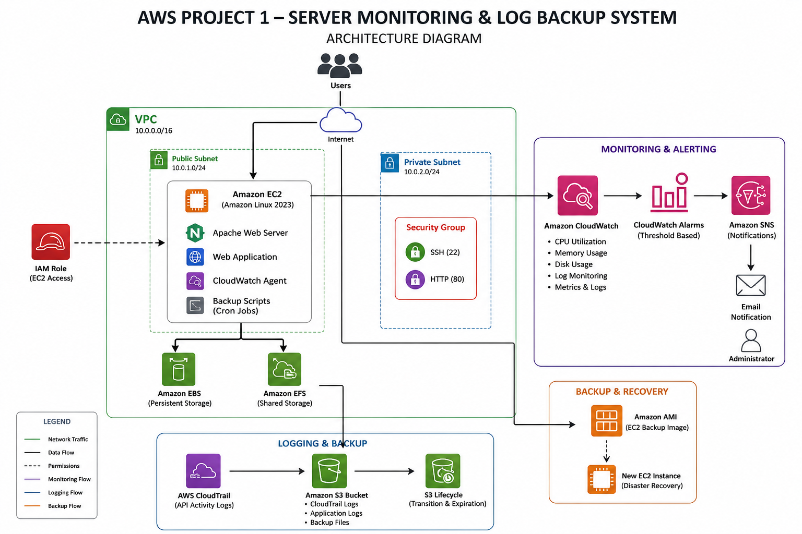
</p>

The architecture diagram demonstrates how Amazon EFS integrates with the EC2 instance, CloudWatch monitoring, Amazon S3 backups, and other AWS services used throughout this project.

---

# Step 1: Create an Amazon EFS File System

1. Sign in to the AWS Management Console.
2. In the search bar, search for **Amazon EFS**.
3. Open the **Amazon Elastic File System** service.
4. Click **Create file system**.

<p align="center">
  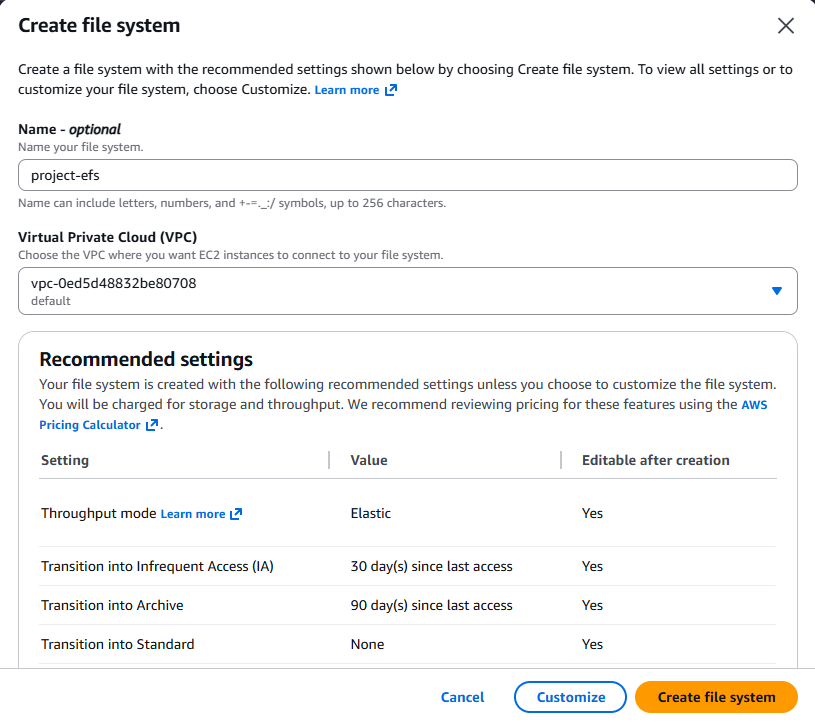
</p>

---

## Configure the File System

Configure the following settings:

| Setting | Value |
|----------|-------|
| Name | project-efs |
| VPC | Select your project VPC |
| Availability | Regional |
| Performance Mode | General Purpose |
| Throughput Mode | Elastic |
| Encryption | Enabled |

After verifying the configuration, click **Create**.

<p align="center">
  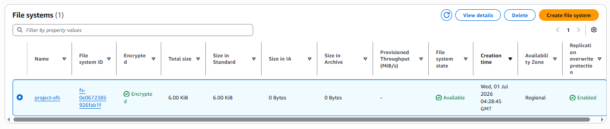
</p>

---

## Verify the File System

Once the file system has been created, verify the following:

- File System ID is generated.
- Lifecycle State is **Available**.
- Encryption is enabled.
- Performance Mode is configured correctly.

<p align="center">
  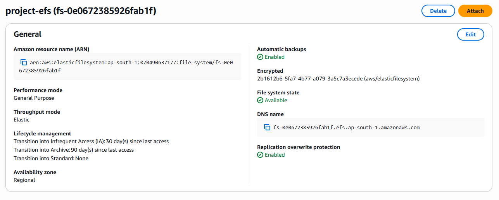
</p>

---

# Step 2: Configure Mount Targets

Mount targets enable your EC2 instance to connect to the EFS file system over the network.

Navigate to:

**Amazon EFS → File Systems → Select your File System → Network**

Verify that:

- Mount Target exists.
- Correct VPC is selected.
- Correct Subnet is selected.
- Lifecycle State is **Available**.

<p align="center">
  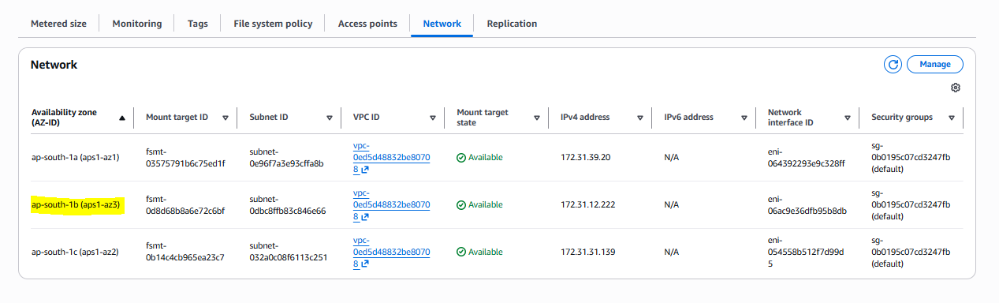
</p>

> **Why are Mount Targets required?**
>
> Amazon EFS is accessed over the network using the NFS protocol. Mount Targets provide network endpoints inside your VPC so EC2 instances can connect securely to the shared file system.

---

# Step 3: Configure Security Groups

Amazon EFS communicates using the **Network File System (NFS)** protocol on **TCP Port 2049**.

Update the Security Group attached to your EFS Mount Target.

Add the following inbound rule:

| Type | Protocol | Port | Source |
|------|----------|------|--------|
| NFS | TCP | 2049 | EC2 Security Group |

This ensures only your EC2 instance can access the EFS file system.

<p align="center">
  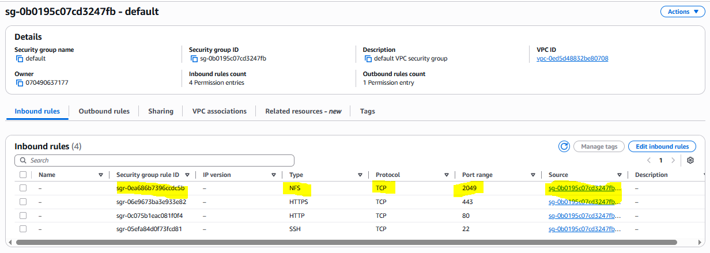
</p>

---

# Step 4: Connect to the EC2 Instance

Connect to the EC2 instance using SSH.

Example:

```bash
ssh -i project-key.pem ec2-user@<EC2-Public-IP>
```

After connecting successfully, update the package repository.

```bash
sudo yum update -y
```

<p align="center">
  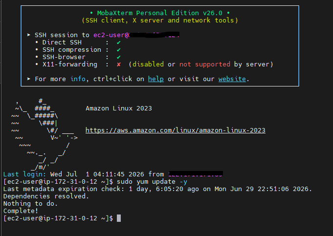
</p>

---

# Step 5: Install Amazon EFS Utilities

Amazon Linux provides the **amazon-efs-utils** package, which simplifies mounting Amazon EFS.

Install it using:

```bash
sudo yum install -y amazon-efs-utils
```

Verify the installation:

```bash
rpm -q amazon-efs-utils
```

Expected output:

```text
amazon-efs-utils-<version>
```

<p align="center">
  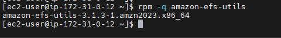
</p>

---

# Step 6: Create a Mount Directory

Create a directory where the EFS file system will be mounted.

```bash
sudo mkdir /efs
```

Verify the directory:

```bash
ls /
```

Expected output should include:

```text
efs
```

---

# Step 7: Mount the Amazon EFS File System

AWS provides a mount command on the **Attach** page of your EFS file system.

Example:

```bash
sudo mount -t efs fs-0123456789abcdef:/ /efs
```

> Replace **fs-0123456789abcdef** with your own File System ID.

If the command completes without errors, the file system has been mounted successfully.

<p align="center">
  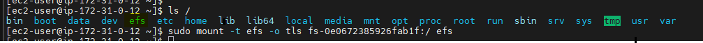
</p>

---

# Step 8: Verify the Mount

Run:

```bash
df -h
```

Expected output:

```text
Filesystem                  Size  Used Avail Use% Mounted on
fs-0123456789abcdef:/       8.0E     0  8.0E   0% /efs
```

You can also verify using:

```bash
mount | grep efs
```

Both commands should confirm that the EFS file system is mounted successfully.

<p align="center">
  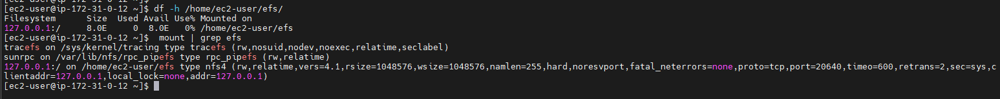
</p>

---

## Core Setup Summary

At this point, you have completed the core setup of Amazon EFS:

- ✔ Created an Amazon EFS file system
- ✔ Verified the file system status
- ✔ Configured Mount Targets
- ✔ Updated Security Groups
- ✔ Connected to the EC2 instance
- ✔ Installed Amazon EFS utilities
- ✔ Created a mount point
- ✔ Mounted the EFS file system
- ✔ Verified the mount successfully

Next, we will test the file system, configure automatic mounting after reboot, and review production use cases and best practices.

---

# Step 9: Test Read and Write Operations

Now that the Amazon EFS file system is mounted, verify that you can create, read, and modify files.

## Create a Test File

Run the following command:

```bash
cd /efs

echo "Amazon EFS Test Successful" | sudo tee test-file.txt
```

Verify the file:

```bash
cat /efs/test-file.txt
```

Expected output:

```text
Amazon EFS Test Successful
```

<p align="center">
  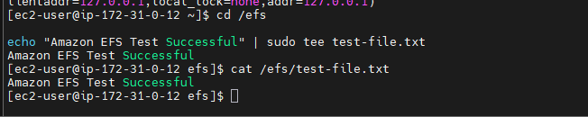
</p>

---

## Verify File Persistence

One of the key advantages of Amazon EFS is that data persists independently of the EC2 instance.

To verify:

1. Restart the EC2 instance.
2. Connect again using SSH.
3. Check whether the file still exists.

```bash
cat /efs/test-file.txt
```

If the file is displayed successfully, your EFS storage is working correctly.

---

# Step 10: Configure Automatic Mount at Boot

Currently, the file system is mounted manually. After a reboot, it will not be available unless it is mounted automatically.

To configure automatic mounting, edit the `/etc/fstab` file.

```bash
sudo nano /etc/fstab
```

Add the following entry:

```text
fs-0123456789abcdef:/ /efs efs defaults,_netdev 0 0
```

> **Note:** Replace `fs-0123456789abcdef` with your own Amazon EFS File System ID.

Save the file and exit the editor.

---

## Verify the Configuration

Test the configuration without rebooting.

```bash
sudo umount /efs

sudo mount -a
```

If there are no errors, the configuration is correct.

Verify again:

```bash
df -h
```

<p align="center">
  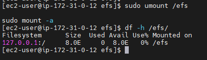
</p>

---

# Project Use Case

In this project, Amazon EFS acts as a centralized shared storage solution.

### Current Architecture

```text
                   +---------------------+
                   |    Amazon EFS       |
                   |  Shared File Store  |
                   +----------+----------+
                              |
                 NFS (TCP Port 2049)
                              |
                     +--------+--------+
                     |                 |
                     |                 |
             +-------+-------+         |
             | Monitoring EC2|         |
             +---------------+         |
                                       |
                          Future EC2 Instances
```

### Why This Matters

As your infrastructure grows, you can launch additional EC2 instances and mount the same EFS file system.

Common use cases include:

- Shared application files
- Centralized log storage
- User-uploaded content
- Shared configuration files
- Kubernetes persistent volumes
- Content Management Systems (CMS)
- Machine Learning datasets

This makes Amazon EFS ideal for scalable, highly available production workloads.

---

# Verification Checklist

Use the following checklist to confirm your Amazon EFS configuration.

| Task | Status |
|------|--------|
| Amazon EFS created | ✅ |
| File System available | ✅ |
| Mount Targets configured | ✅ |
| Security Group updated | ✅ |
| EC2 connected successfully | ✅ |
| Amazon EFS utilities installed | ✅ |
| File system mounted | ✅ |
| Read/Write test completed | ✅ |
| Auto-mount configured | ✅ |
| Mount verified after reboot | ✅ |

---

# Best Practices

Follow these recommendations when using Amazon EFS in production.

### Security

- Enable encryption at rest.
- Enable encryption in transit.
- Restrict NFS access using Security Groups.
- Grant least-privilege IAM permissions.

### Performance

- Use **Elastic Throughput** unless your workload requires Provisioned Throughput.
- Monitor file system performance using Amazon CloudWatch.
- Avoid unnecessary large file transfers during peak traffic.

### Availability

- Use Regional EFS for Multi-AZ resilience.
- Enable AWS Backup for scheduled backups.
- Test restore procedures periodically.

### Cost Optimization

- Enable Lifecycle Management.
- Move infrequently accessed files to **EFS Infrequent Access (IA)**.
- Delete unused file systems.

---

## Key Takeaways

After completing this section, you have successfully:

- Created an Amazon EFS file system
- Configured Mount Targets
- Configured Security Groups
- Installed Amazon EFS utilities
- Mounted Amazon EFS on an EC2 instance
- Verified file operations
- Configured automatic mounting
- Prepared the environment for future multi-instance deployments

Your infrastructure is now ready to provide scalable and shared storage for production workloads.

---

# Troubleshooting

Even with a correct configuration, you may encounter issues while mounting or accessing Amazon EFS. The following table lists common problems and their solutions.

| Issue | Possible Cause | Solution |
|-------|----------------|----------|
| Mount command hangs | NFS port (2049) blocked | Verify the EFS Security Group allows TCP port **2049** from the EC2 Security Group. |
| Connection timed out | Missing or unavailable Mount Target | Ensure the EFS Mount Target is created in the same VPC and Availability Zone. |
| `mount.nfs4: Connection timed out` | Network connectivity issue | Check VPC, Route Tables, NACLs, and Security Groups. |
| `mount: wrong fs type` | Missing EFS utilities | Install the package using `sudo yum install -y amazon-efs-utils`. |
| `Permission denied` | Incorrect permissions | Verify the mount point permissions and EFS access configuration. |
| File system not mounted after reboot | Incorrect `/etc/fstab` entry | Validate the syntax and test using `sudo mount -a`. |

---

## Useful Verification Commands

### Check Mounted File Systems

```bash
df -h
```

---

### Verify the EFS Mount

```bash
mount | grep efs
```

---

### Display File System Usage

```bash
du -sh /efs
```

---

### Verify the Test File

```bash
cat /efs/test-file.txt
```

---

### Test Automatic Mount Configuration

```bash
sudo mount -a
```

If no errors are displayed, the `/etc/fstab` configuration is correct.

---

# Cleanup

If you no longer need the Amazon EFS file system, follow these steps to clean up the resources.

## Step 1: Unmount the File System

```bash
sudo umount /efs
```

---

## Step 2: Remove the Mount Directory (Optional)

```bash
sudo rmdir /efs
```

---

## Step 3: Remove the Auto-Mount Entry

Edit the `/etc/fstab` file.

```bash
sudo nano /etc/fstab
```

Delete the Amazon EFS entry, then save the file.

---

## Step 4: Delete the Amazon EFS File System

1. Open the AWS Management Console.
2. Navigate to **Amazon EFS**.
3. Select the file system.
4. Delete all associated Mount Targets.
5. Delete the EFS File System.

> **Note:** Ensure you no longer need the data stored in the file system before deleting it, as this action is permanent.

---

# Conclusion

In this section, we successfully integrated **Amazon Elastic File System (EFS)** into our AWS Server Monitoring & Log Backup System.

We learned how to:

- Understand Amazon EFS and its architecture
- Create and configure an EFS file system
- Configure Mount Targets and Security Groups
- Install Amazon EFS utilities
- Mount the file system on an EC2 instance
- Verify file operations
- Configure automatic mounting after reboot
- Apply production best practices
- Troubleshoot common issues

Amazon EFS provides a scalable, highly available, and fully managed shared file storage solution, making it an excellent choice for applications that require concurrent access from multiple EC2 instances.

With Amazon EFS integrated, our project now supports centralized shared storage, improving scalability, flexibility, and operational efficiency.

---

# Screenshot Checklist

| Screenshot | File Name |
|------------|-----------|
| Amazon EFS Dashboard | `01-efs-dashboard.png` |
| Create EFS File System | `02-create-efs.png` |
| EFS Created Successfully | `03-efs-created.png` |
| Mount Targets | `04-mount-targets.png` |
| Security Group Configuration | `05-security-group.png` |
| EC2 SSH Terminal | `06-ec2-terminal.png` |
| Install EFS Utilities | `07-install-efs-utils.png` |
| Mount EFS File System | `08-mount-command.png` |
| Verify Mount (`df -h`) | `09-df-output.png` |
| Create Test File | `10-test-file.png` |
| Configure `/etc/fstab` | `11-fstab.png` |

---

# Next Section

In the next document (**10-CloudWatch.md**), we will configure **Amazon CloudWatch** to monitor the EC2 instance by collecting system metrics, logs, and creating dashboards for real-time visibility into the server's health and performance.

---

# Related Documents

Continue with the next document in this project:

- **10-CloudWatch.md** – Configure Amazon CloudWatch Agent
- **11-CloudWatch-Alarms.md** – Create CloudWatch Alarms
- **12-SNS.md** – Configure Email Notifications
- **13-AMI.md** – Create an Amazon Machine Image (AMI)
- **14-S3-Backup.md** – Backup Logs to Amazon S3
- **15-Testing.md** – Validate the Complete Solution
- **16-Troubleshooting.md** – Project-Level Troubleshooting
- **17-Project-Summary.md** – Final Architecture and Project Summary

---

> **Congratulations! 🎉**
>
> You have successfully completed the **Amazon EFS** implementation for this project. The infrastructure now includes scalable shared storage and is ready for the next phase: monitoring with Amazon CloudWatch.
